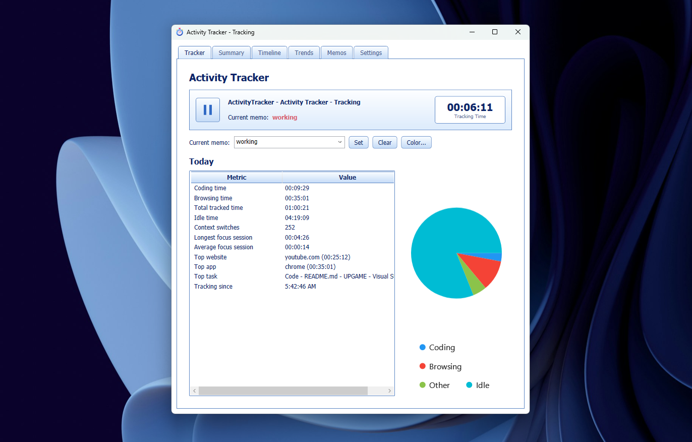

A Windows desktop app that tracks which window (and, for browsers, which tab) is in
the foreground and how long you spend on it, with a WPF UI, a CLI summary command,
and both a SQLite database and structured JSONL logs.

## Preview



## Features

- Tracks the active window/process, and for supported browsers (Chrome, Edge, Brave,
  Firefox) the active tab title, URL, and domain via Windows UI Automation.
- Event-driven focus tracking (`SetWinEventHook`) plus periodic idle detection
  (`GetLastInputInfo`) - idle time is excluded from active session durations.
- Every session is persisted to a SQLite database (via EF Core) **and** appended to a
  per-day JSONL log file, so you always have both a queryable DB and a plain-text log.
- `ActivityTracker.exe summary [date]` prints a detailed daily report to the console.
- WPF UI with six tabs: **Tracker** (Play/Pause toggle, current-memo tagging, live
  KPI/marquee status, today's stats + pie chart), **Summary** (per-day breakdown
  with charts, tables, and a date picker limited to days that actually have data),
  **Timeline** (chronological session list with search and memo filters,
  multi-select bulk memo tagging/deletion, and a color-coded visual timeline
  strip), **Trends** (activity by hour, app usage over the last 7 days), **Memos**
  (create, rename, recolor, and delete memos), and **Settings** (poll interval,
  idle threshold, process-name lists, wallpaper).
- Manual activity tagging via memos: set a "current memo" that auto-tags every
  session going forward until you change it, retroactively re-tag past sessions
  from the Timeline tab, and give each memo its own color (native color picker)
  that shows up everywhere it's referenced, including the timeline strip.
- Tracking does **not** start automatically - launch the app and click the
  Play icon on the Tracker tab when you're ready.
- Charts (via LiveCharts2) on the Tracker, Summary, and Trends tabs.
- Retro Windows XP / Windows Media Player-styled theme (Tahoma font, Luna-blue
  gradients, rounded buttons) applied across the whole UI.

## Requirements

- Windows (the app relies on Win32 APIs and UI Automation, so it will not run on
  other platforms).
- .NET 9 SDK.

## Build & run

From the repo root:

```
dotnet build
```

The built executable lands at `src\ActivityTracker\bin\Debug\net9.0-windows\ActivityTracker.exe`.
Just run it - on first launch it automatically applies EF Core migrations, so no
manual `dotnet ef database update` step is required.

## Usage

**GUI**: launch `ActivityTracker.exe` with no arguments. Tracking does not start
automatically - click the Play icon on the Tracker tab, and it runs in the
background while you use your PC normally.

**CLI summary**:

```
ActivityTracker.exe summary                  # today
ActivityTracker.exe summary 08-07-2026       # a specific date (MM-DD-YYYY by default)
```

The date format is controlled by `summaryDateFormat` in `config.json` (see below);
it's not editable from the Settings tab, only by hand-editing the config file.

## Configuration

Settings live in `%LOCALAPPDATA%\ActivityTracker\config.json`, created with defaults
on first run:

| Field | Meaning |
|---|---|
| `idlePollIntervalSeconds` | How often the tracker polls for idle time and in-window tab changes. |
| `idleThresholdSeconds` | How long without input before a session is cut off as idle. |
| `summaryDateFormat` | .NET date format string used to parse the CLI `summary` command's date argument. |
| `codingProcessNames` | Process names counted toward "coding time" (e.g. `Code`, `devenv`). |
| `browserProcessNames` | Process names treated as browsers for tab/URL extraction and "browsing time". |
| `wallpaperPath` | Optional background image for the main window. |
| `activeMemoName` | The memo currently auto-applied to new sessions (set via the Tracker tab); `null` when none is active. |

Most of these (aside from the date format) are also editable from the Settings tab,
which writes back to the same file.

## Data storage

- SQLite database: `%LOCALAPPDATA%\ActivityTracker\activitytracker.db`
- JSONL logs: `%LOCALAPPDATA%\ActivityTracker\logs\yyyy-MM-dd.jsonl` (one file per
  local calendar day; restarting the tracker just resumes appending to today's file)

Timestamps are stored in UTC on disk (both DB and JSONL) but always converted to the
machine's local timezone for display in the UI and CLI output.

## Project structure

| Folder | Contents |
|---|---|
| `Models` | `Session` (tracked-activity record) and `Memo` (a tag with a name and color). |
| `Data` | EF Core `AppDbContext`, migrations, `MemoRepository` (find-or-create memos by name), and `ColorUtil` (deterministic label-to-color hashing). |
| `Native` | Win32 P/Invoke, the foreground-window event hook, and UI Automation browser-tab reading. |
| `Tracking` | `TrackingService`, which ties the hook, idle polling, DB, JSONL logger, and current-memo auto-tagging together. |
| `Logging` | The JSONL session logger. |
| `Stats` | Daily/weekly/hourly stats calculations and the CLI summary text formatter. |
| `Config` | `AppSettings`, loaded from and saved to `config.json`. |
| `Themes` | The retro XP/WMP WPF style resources. |
| `Assets` | The application icon (`AppIcon.ico`). |

## Known limitations

- Browser tab/URL extraction is best-effort: it walks the browser's UI Automation
  tree looking for an address-bar-like edit control, which can fail silently on
  browser versions/localizations that don't match the expected element names.
- The Trends tab's "activity by hour" chart is a column/bar chart (24 hourly totals
  across all history), not a literal day-of-week x hour-of-day heatmap grid.
- Tab switches *within* the same browser window rely on polling (window title
  changes), not an instant event, so detection latency is bounded by
  `idlePollIntervalSeconds`.
